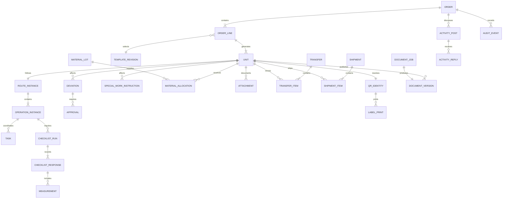
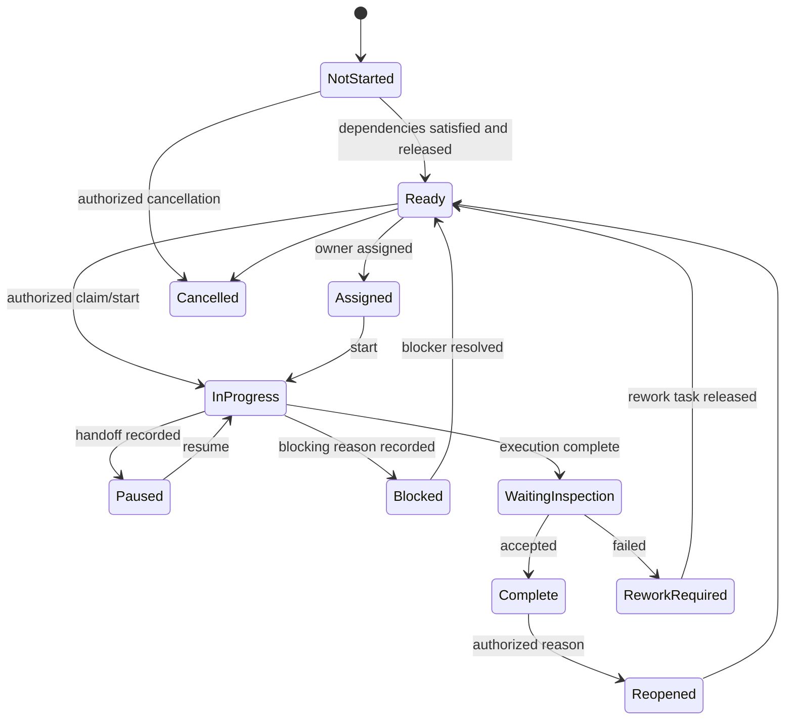

# 03 - Information Architecture and Workflow States

## Identifier policy

Every persistent entity uses a UUID primary key. User-facing numbers are separate immutable business identifiers. A random 128-bit `publicRef`, encoded in URL-safe base32, is created for every scannable record and is never recycled.

| Identifier | Example | Rule |
| --- | --- | --- |
| Order number | `26SO00729` | Supplied from AIMCOR; unique within source system; not a database key |
| Line number | `1` | Immutable within an Order |
| Unit sequence | `1` | Immutable within a Line; cancelled sequences are not reused |
| Unit ID | `26SO00729_1.1` | Derived once at Unit creation and then stored immutably |
| Serial number | `2607143053` | Assignable/revisable through an audited command; never the sole identity |
| Public reference | `7J4K...` | Opaque stable QR/deep-link reference; contains no business or sensitive data |

Superseded or merged records keep their public reference and resolve to a notice plus the current record. Reprinting a label never creates a new domain record.

## Entity model

| Entity | Purpose and important fields | Relationships and governance |
| --- | --- | --- |
| `Order` | Source system/key, order number, customer/PO snapshot, dates, coordinator, commercial/payment release, status, row version | Has Lines, activity, documents, Teams link; commercial corrections are audited |
| `OrderLine` | Line number, product, description, quantity, ordered specification, template revision, progress | Belongs to Order; has Units; quantity cannot shrink below created non-cancelled Units |
| `Unit` | Unit ID, sequence, serial, as-built specification, current location, status, hold, publicRef | Belongs to Line; has route, checklists, changes, evidence, shipments and PDFs |
| `Package` | Package ID, calculated status, publicRef | Belongs to a Line/Order; contains Units and PackageComponents; post-pilot |
| `Component` | Part/material identity, serial/heat/lot, tracking level, status, location, publicRef | May be unallocated or allocated to one Unit/Package with allocation history |
| `MaterialLot` | Part, grade, heat/lot, quantity/unit, supplier, receipt/inspection, certificate | Allocated through append-only `MaterialAllocation` transactions |
| `Template` | Product/order family and owner | Has immutable numbered revisions |
| `TemplateRevision` | Status, effective dates, route/checklist/package definitions, release notes, checksum | Draft/test/approved/retired; assigned Orders keep the original revision |
| `RouteInstance` | Frozen route definition, overall progress | One per Unit or scoped target; has ordered OperationInstances |
| `OperationInstance` | Sequence, location/department, dependency, status, instructions, expected result | Has Tasks, ChecklistRuns, labour sessions and evidence |
| `Task` | Action type, scope, owner, dates, status, priority, hold, instructions | May attach to an operation or be a general Order/Line/Unit action |
| `ChecklistDefinitionRevision` | Typed items, conditions, evidence, tolerance and completion rules | Immutable once approved; referenced by a template revision |
| `ChecklistRun` | Frozen definition reference, target, status, assigned inspector | Contains responses; reinspection creates a new attempt |
| `ChecklistResponse` | Item key, typed value/result, remarks, actor/time, version | Never silently overwritten; correction supersedes a response |
| `Measurement` | Name, numeric value, unit, nominal/lower/upper bounds, result, instrument | Belongs to a response/operation/Unit; stores normalized value and entered text |
| `ActivityPost` / `ActivityReply` | Category, subject/body, author/time, target badges, resolved state | One reply level; may link to structured records created from the post |
| `SpecialWorkInstruction` | Original condition, work, measurement/tolerance, reason, affected Units, approvals | Versioned controlled record with before/after evidence and verification |
| `Deviation` | Original vs proposed/as-built part/material, reason, affected Units, approvals | Includes customer/drawing flags and final verification |
| `Approval` | Policy/type, decision, approver, time, reason, target version | Append-only; reaction/acknowledgement is never an approval |
| `Attachment` | Kind, category, blob key/version, media type, size/checksum, target, capture metadata | Storage URL is never permanent domain identity; upload is finalized server-side |
| `Transfer` / `TransferItem` | Origin/destination, container, status, dispatch/receipt, discrepancies | One transfer may contain many Units/components; preserves item-level receipt |
| `Shipment` / `ShipmentItem` | Customer destination, packages, carrier, PRO/tracking, weight/dimensions | Dispatch requires configured Unit/package readiness |
| `QRIdentity` / `LabelPrint` | PublicRef, record type, status; label profile/version, printer/user/time | Stable identity with append-only print/reprint/damage/loss events |
| `AuditEvent` | Actor, action, target, facility, time, correlation, previous/new values, evidence | Append-only and application-controlled; correction points to superseded event |
| `DocumentJob` | UUID, type, snapshot, manifest, status, attempts, temp/output paths, checksums | Isolated execution; idempotent on target snapshot and document type |
| `DocumentVersion` | Type, version, draft/final, blob version, checksum, released/superseded metadata | Released versions are immutable; correction creates a new version |

## Relationship diagram

## Ownership and scope rules

- Every mutable business record has an owning scope: Order, Line, Unit, Package, Component, or system configuration.
- Unit-specific records require a Unit ID even when Order/Line can be derived. The server rejects inconsistent ancestor IDs.
- An action applied to selected Units creates an explicit association per Unit; no implicit `all current and future Units` semantics.
- Order-wide instructions are copied or referenced explicitly when they affect Unit completion.
- Location is an attribute of work and custody, never a reason to duplicate an Order.
- Files require a discriminated kind and target before finalization. `GENERAL` is allowed only for Order-level reference documents, not QC evidence.

## Status models

### Task and operation

`WaitingMaterial`, `WaitingEngineering`, `WaitingCustomer`, and `WaitingTransfer` are hold reasons on `Blocked`, not separate lifecycle states. The UI presents them as friendly badges.

### Inspection

`NotStarted -> InProgress -> Submitted -> Passed | Failed | NeedsReview`. A failure blocks release and creates or links a rework disposition. Reinspection is a new attempt; the failed attempt remains immutable. Only Quality can pass final inspection or approve an override, and overrides require reason plus policy-authorized approver.

### Transfer

`Draft -> Requested -> Preparing -> ReadyToDispatch -> InTransit -> Received | ReceivedWithDiscrepancy -> Closed`. Cancellation is allowed before dispatch. After dispatch, correction uses a discrepancy/return flow. Current custody updates at dispatch or receipt according to the configured route, and every TransferItem is independently confirmed.

### Shipment

`Draft -> Packing -> Ready -> Released -> Dispatched -> Delivered -> Closed`, with `OnHold` represented by a hold record. Dispatch is blocked until required packaging checks, Unit releases, weight/dimensions, and documents are complete.

### Unit, line, package, and order calculation

- **Unit:** manually placed on an authorized hold, but otherwise calculated from route, inspections, rework, shipment, and cancellation. High-level values are `Draft`, `ReleasedToProduction`, `InProduction`, `Blocked`, `AwaitingQuality`, `Rework`, `ReadyToShip`, `Shipped`, `Complete`, `Cancelled`.
- **Line:** calculated counts for each Unit state plus overall state. A fraction always links to the matching Unit set.
- **Package:** calculated from required component readiness, package operations, package inspection, and shipment.
- **Order:** calculated from non-cancelled Lines/Units plus order-level release/closure commands. `Complete` requires all required Unit documents to be successfully released.

Calculated states store a projection for query performance, but the projection includes the calculation version and can be rebuilt from authoritative child records and audit events.

## Controlled commands and concurrency

Commands use a client-generated idempotency key and expected `rowVersion`. Examples include `confirmImport`, `startTask`, `pauseTask`, `completeTask`, `submitInspection`, `approveDeviation`, `assignSerial`, `dispatchTransfer`, `releaseUnit`, and `supersedeDocument`.

The server:

1. Authenticates the actor and checks role/facility/state policy.
2. Returns the existing result if the idempotency key was already committed for the same actor/command.
3. Rejects a reused key with a different payload.
4. Checks the expected row version and returns a friendly conflict with current state.
5. Validates prerequisites and evidence.
6. Commits state changes, domain records, outbox messages, and audit events in one database transaction.

## Audit and correction rules

- Domain tables retain current projections; `AuditEvent` and versioned controlled records retain history.
- Normal users cannot update or delete audit events.
- Correcting a response, measurement, serial, comment, change, or approval creates a new version/event with reason and a pointer to the superseded item.
- Deletion of production evidence is logical removal by an authorized role; the original blob version and audit metadata remain under retention policy.
- Timestamps are stored in UTC with the acting facility and displayed in the viewer's selected time zone, always exposing the exact timestamp.
- Audit export includes correlation IDs tying a command to attachments, notifications, document jobs, and resulting changes.

## Template governance

Template revisions progress through `Draft -> InReview -> Approved -> Retired`. A draft may be cloned from an approved revision. Approval requires named product/process and quality owners, golden-order fixtures, route validation, checklist validation, document-manifest validation, and rendered sample outputs. An approved revision is immutable. Emergency changes create a new revision; applying it to active Units is an explicit, audited migration with a preview of added/removed/changed work.

