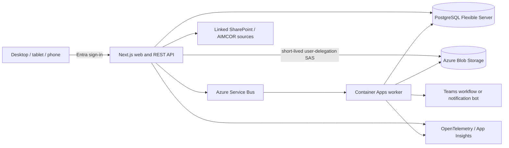
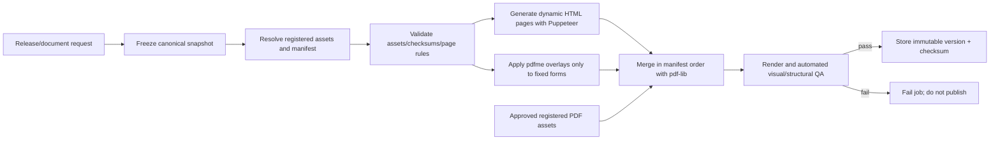

# 05 - Document and Technical Architecture

## Target architecture

Use a TypeScript modular monolith with clear domain modules and one PostgreSQL database. The web/API service is a Next.js/React application, and background work runs in a separate TypeScript worker (decision D-019). Deploy the responsive web/API service and the isolated worker to Azure Container Apps. Selection of ORM/database-access and migration tooling is delegated to ticket A1 after repository discovery under the evaluation criteria in decision D-020; an accepted ADR is required before any domain schema is implemented. Use Azure Service Bus for reliable background work, Blob Storage for binary objects, Microsoft Entra ID for single-tenant identity, Key Vault/managed identity for secrets, Application Insights/OpenTelemetry for observability, and Bicep for infrastructure.



Do not begin with microservices. Domain modules use internal interfaces and transactional boundaries so PDF/notification workers can be separated later without splitting the core prematurely.

## Domain modules

- Identity and authorization
- Order intake and execution structure
- Templates, routes, tasks, and checklists
- Materials, components, deviations, and approvals
- Activity and notifications
- Attachments and media
- Transfers and shipments
- QR identities and label printing
- Quality release and document generation
- Search, reporting, audit, and administration

Modules may read through explicit query services. Cross-module mutations use application commands/domain events rather than direct table manipulation.

## Authentication and authorization

- Register one workforce/single-tenant Entra application for the pilot.
- Define application roles and assign Rotech security groups to them. Store the Entra object ID as actor identity; cache display name/email only for presentation/history.
- Enforce authorization in API policies using app role, facility scope, command, target state, and separation-of-duty rules.
- Use managed identity for service-to-service Azure access. Do not store storage-account keys or database passwords in code.
- Validate QR and post-login return paths against same-origin routes. The QR reference grants no access.
- Require step-up/recent authentication only if Rotech security policy demands it for release/administration; do not invent password prompts inside the app.

## Storage and uploads

1. Client requests an upload intent with target, category, media type, size, checksum when available, and idempotency key.
2. API authorizes the target and returns an attachment ID, blob key, and short-lived create-only user-delegation SAS scoped to that object.
3. Client uploads directly to Blob Storage and calls finalize. The attachment enters `PendingValidation`.
4. API/worker verifies blob existence, size, declared/actual type, checksum, image metadata, malware/security scan result, and target state. An attachment remains `PendingValidation` (or moves to `Quarantined` on a failed or suspicious result) until every required validation and the malware/security scan complete.
5. Only a fully validated attachment becomes an accepted attachment with its audit event and queued thumbnail/compression work. Unvalidated or quarantined evidence cannot satisfy a required checklist evidence rule and cannot enter a released document. If the scanning service is unavailable, attachments stay `PendingValidation` and the outage is surfaced operationally; the system never silently accepts evidence because a scanner was down. Unfinalized blobs expire through lifecycle policy.

Use random blob keys, not customer/order data. Keep originals for controlled evidence; create derived thumbnails/previews as separate linked objects. Strip unnecessary photo metadata from derivatives while retaining required capture metadata in the database. Configure limits by category, with a pilot default of 20 MB per image/file. General video capture remains deferred; the single exception is a constrained short-video evidence category for the 1196 free-rotation step (length- and size-limited, subject to Quality approval in Workshop 2, Document 04).

## Transaction and job reliability

- Commit domain changes, audit events, and outbox records in one PostgreSQL transaction.
- An outbox dispatcher publishes to Service Bus with correlation/event IDs.
- Workers store attempt, lease, status, error category, and result; retry transient failures with bounded exponential backoff and dead-letter permanent failures.
- A job's idempotency identity is document/notification type plus immutable target snapshot/version. Retrying never creates another released document or milestone post.
- Never perform durable file generation inside the request lifecycle.

## Search

Use PostgreSQL full-text search plus `pg_trgm` for the pilot. Maintain a denormalized, permission-filterable search projection containing record type, identifiers, customer/PO, product, serial, task/comment text, material/heat, shipment references, file name, and deep-link anchor. Search results identify their type and exact target. Defer Azure AI Search until scale, document OCR, or ranking evidence requires it.

## Versioned REST interface

All controlled mutations require `Idempotency-Key`; commands that change an existing aggregate require `If-Match`/expected row version. Errors use a stable code, friendly message, correlation ID, field details where safe, and retryability flag.

| Area | Representative contract |
| --- | --- |
| Import | `POST /api/v1/order-imports`; `GET /order-imports/{id}`; `POST /order-imports/{id}/confirm` |
| Orders/Units | `GET /orders`; `GET /orders/{id}`; `GET /units/{id}`; `POST /units/{id}/assign-serial` |
| Work commands | `POST /tasks/{id}/start`, `/pause`, `/complete`, `/fail`, `/reopen` |
| Checklists | `GET /checklist-runs/{id}`; `POST /checklist-runs/{id}/responses`; `/submit` |
| Changes | `POST /units/{id}/deviations`; `POST /deviations/{id}/approve`; equivalent special-instruction endpoints |
| Attachments | `POST /attachments/intents`; `POST /attachments/{id}/finalize`; `POST /attachments/{id}/supersede` |
| Activity | `GET/POST /orders/{id}/activity`; `POST /activity/{id}/replies`; `/convert` |
| QR/labels | `GET /r/{publicRef}` as web resolver; `POST /labels/render`; `POST /labels/{id}/reprint` |
| Documents | `POST /units/{id}/document-jobs`; `GET /document-jobs/{id}`; `POST /document-versions/{id}/supersede` |
| Search | `GET /api/v1/search?q=...&type=...` with permission filtering before pagination |

Request/response schemas use discriminated unions for activity, attachments, checklist values, controlled changes, and job results. Numeric measurements carry decimal strings plus UCUM-compatible unit codes to avoid floating-point ambiguity.

## Audit event contract

```json
{
  "eventId": "uuid",
  "occurredAt": "UTC timestamp",
  "actor": {"kind": "human | service | system", "entraObjectId": "uuid or null", "displayNameSnapshot": "..."},
  "facilityId": "uuid, or null for legitimate system events",
  "action": "task.completed",
  "target": {"type": "Task", "id": "uuid", "unitId": "26SO00729_1.1"},
  "correlationId": "uuid",
  "idempotencyKeyHash": "...",
  "previous": {},
  "current": {},
  "evidenceIds": ["uuid"],
  "supersedesEventId": null,
  "reason": null
}
```

The audit target is polymorphic: any record type (task, template revision, material lot, transfer, label, document version, configuration) may be a target, not only Order-scoped records. Sensitive fields are redacted by audit-view policy, not omitted from the underlying authorized history. Logs reference IDs and correlation data rather than duplicating document/photo contents.

## PDF/document architecture

### Document types

- **Work Order Plan:** order cover, source facts, line/Unit summary, warnings, route overview, master QR, and handwritten-note space.
- **Unit QC and Manufacturing History:** cover, ordered specification, approved changes, as-built specification, materials, route, checklists, measurements, tests, rework, sign-offs, selected evidence, shipping, release.
- **Package history:** Unit history plus package components, package assembly/alignment, inspection, and shipping.
- **Order Completion Summary:** all Lines/Units, status, serials, changes, release dates, and links/checksums for final Unit documents.
- **Labels/travellers:** print profiles with QR and human-readable identifiers.

### Generation pipeline



Approved GA drawings, curves, brochures, manuals, and bulletins remain registered PDFs. Runtime selection uses structured configuration and an asset catalog; it never guesses a filename. Normalization rules, including shared T/TS motor-frame drawings, are versioned and tested before asset lookup. HTML is used only for dynamic pages. `pdfme` is limited to approved fixed-layout overlays. `pdf-lib` controls the final manifest merge.

### Job isolation and manifest

Each job has a UUID and a dedicated temporary prefix/directory. No shared output filename is permitted. The job stores:

- Order/Line/Unit/package snapshot and schema version.
- Original AIMCOR document ID, checksum, and verified values.
- Template/checklist/route revisions.
- Quote/CPQ configuration and pricing-rules version when supplied by an upstream CPQ flow.
- Document template/renderer versions.
- Manifest entries with asset catalog IDs, checksums, expected page counts, and generator inputs.
- Selected photo IDs/blob versions and transformations.
- Final blob key/version, byte size, page count, checksum, validation results, and logs.

### Draft, release, and correction

- Draft previews are watermarked, replaceable, and not customer/quality records.
- Final generation is allowed only from a release-ready frozen snapshot.
- A released `DocumentVersion` and referenced blob version are immutable. This immutability is application-enforced: no mutation path exists for released versions, and blob versioning/soft delete protect the stored object. Azure immutable-storage (WORM) policies are an optional storage-enforced hardening to be decided at Workshop 5, not an assumed dependency.
- Correction reopens only the necessary domain record under authorization, produces superseding records/events, freezes a new snapshot, and releases a new document version. The previous version remains accessible and clearly superseded.
- Regeneration from an identical snapshot/manifest returns the existing version. A renderer-only change requires an explicit new document version and reason.

### Photo selection and performance

Checklist/template rules select mandatory evidence categories. Quality can add/remove optional photos before snapshot with an audited reason. Use compressed PDF derivatives while preserving original evidence separately. Enforce per-section and total photo budgets, captions with category/date/Unit, and no cross-Unit query paths. Generate asynchronously and stream/merge from isolated storage rather than loading an unbounded package into memory.

## Teams and SharePoint boundaries

- Store one master Teams thread URL per Order and deep links to application records in milestone notices.
- Pilot notifications: order released, blocker/material issue, inspection failure/rework, Unit complete, quantity milestone, ready to ship, and order complete. Deduplicate/update notices where supported.
- Use an approved Teams workflow webhook or installed notification bot. Do not use Teams as a log or assume standard app-only Graph message creation.
- Preserve SharePoint URLs for original controlled documents where needed. Blob Storage is the application-managed evidence and generated-document store; bulk SharePoint migration is out of scope.

## Environments, deployment, and recovery

- Separate development, test, and production Azure resources, identities, databases, queues, containers, and Teams destinations.
- Build immutable container images; promote the same digest after automated gates. Apply versioned database migrations as a controlled release step with tested rollback/forward-fix instructions.
- The authenticated web frontend is internet-reachable so QR scans work from any managed device; Entra sign-in and server authorization remain mandatory for every request, and an unauthorized scan discloses no order or customer details. Data, storage, queue, and management surfaces (PostgreSQL, Blob Storage control plane, Service Bus, Key Vault, administration endpoints) remain on private networking where practical.
- Use managed identities, Key Vault, least-privilege RBAC, TLS, encryption at rest, Blob versioning/soft delete, and database backups/PITR.
- Define pilot recovery targets after business review; initial planning target is RPO <= 15 minutes and RTO <= 4 hours, validated by restore drills before production-source-of-truth cutover.
- Monitor availability, latency, authorization denials, concurrency conflicts, pending/failed uploads, outbox age, queue/dead-letter depth, document failures, notification failures, and storage/database capacity.

## Reversibility

Reversible: UI framework components, Teams notification mechanism, search service, label hardware, and background compute host if contracts stay stable. Costly to change later: Unit identity, aggregate boundaries, template-version semantics, audit/correction model, attachment targeting, stable QR references, document snapshots/manifests, and source-of-truth boundaries. These receive design and pilot validation first.

## Authoritative implementation references

- [Microsoft Entra application roles](https://learn.microsoft.com/en-us/entra/identity-platform/howto-add-app-roles-in-apps)
- [Direct browser upload to Blob Storage with a user-delegation SAS](https://learn.microsoft.com/en-us/azure/developer/javascript/tutorial/browser-file-upload-azure-storage-blob)
- [Azure Container Apps jobs](https://learn.microsoft.com/en-us/azure/container-apps/jobs)
- [Microsoft Graph channel-message permissions](https://learn.microsoft.com/en-us/graph/api/channel-post-messages?view=graph-rest-1.0)
- [Azure Blob immutable storage](https://learn.microsoft.com/en-us/azure/storage/blobs/immutable-storage-overview)
- [Azure Database for PostgreSQL backup and point-in-time recovery](https://learn.microsoft.com/en-us/azure/postgresql/backup-restore/concepts-backup-restore)
